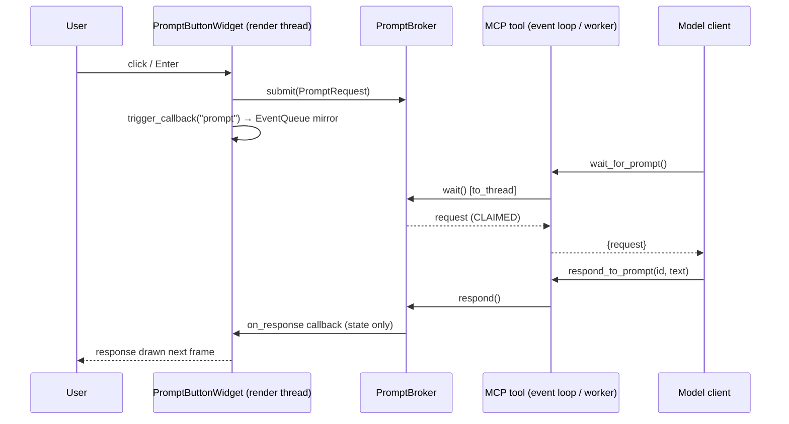

# Backend Specification: Prompt Bridge — UI-Initiated Model Interaction

## Project Overview

champi-imgui (v1.19.6) is an ImGui-based MCP server and UI framework. Today the interaction
model is strictly one-directional: the model calls tools to build a UI, and can only learn
about user interaction by subscribing to widget events (`subscribe_events`) and polling
(`poll_events`). There is no first-class way for the **user** to start an exchange from the UI.

This initiative adds the **Prompt Bridge**: a widget the user presses to send a prompt to the
model, the server-side plumbing that delivers that prompt to the MCP client, and a way for the
model to write its answer back into the widget. It also adds the host-window controls needed
for the canonical use case:

> "A button, always on top, in the top-left corner of my screen. When I press it, it asks a
> prompt to the model."

Existing building blocks this spec reuses:

- `core/events.py` — `EventQueue` / `WidgetEvent` (thread-safe bounded deque, subscriptions)
- `core/widget.py` — `Widget` ABC, `trigger_callback()`, module-level `set_event_queue()` hook
- `core/canvas.py` — `CanvasManager` owns the single `hello_imgui.run()` host window; each
  `Canvas` is an ImGui window rendered inside it by `_render_frame()`
- `api/server.py` — `create_mcp_app()` factory; every tool returns
  `{"success": bool, "data": dict}` or `{"success": False, "error": str}`
- FastMCP 3.3.1 `Context` exposes `sample()`, `report_progress()`, `send_notification()`;
  `ctx.session.check_client_capability()` reports client sampling support.

Non-goals for this initiative:

- Speech input/output (belongs to champi-stt / champi-tts).
- Multi-turn conversation UI inside the canvas (a chat panel). One request → one response.
- Web transport changes. Works over stdio and Streamable HTTP unchanged.

---

## Section 1: Host Window Control (Overlay Placement)

### 1.1 Problem

`CanvasManager._render_loop()` hard-codes the host window to `1600x900`, decorated, not
floating, auto-positioned. Every canvas lives inside this one window, so an always-on-top
launcher in a screen corner is impossible today. Canvas placement inside the host window is
also not applied: `CanvasState.position` exists but `_render_frame()` never uses it.

### 1.2 `HostWindowConfig`

New file `src/champi_imgui/core/host_window.py`:

```python
class Anchor(str, Enum):
    TOP_LEFT = "top_left"
    TOP_RIGHT = "top_right"
    BOTTOM_LEFT = "bottom_left"
    BOTTOM_RIGHT = "bottom_right"
    CENTER = "center"

@dataclass
class HostWindowConfig:
    title: str = "champi-imgui"
    width: int = 1600
    height: int = 900
    x: int | None = None            # explicit screen position; wins over anchor
    y: int | None = None
    anchor: Anchor | None = None    # resolved against the primary monitor work area
    margin: int = 0                 # px inset from the anchored edge(s)
    always_on_top: bool = False     # glfw.FLOATING
    decorated: bool = True          # glfw.DECORATED
    opacity: float = 1.0            # glfw.set_window_opacity, 0.1..1.0
    resizable: bool = True          # glfw.RESIZABLE

    def to_dict(self) -> dict[str, Any]: ...
```

### 1.3 Applying the config (render thread only)

All GLFW calls happen on the render thread. `CanvasManager` gains:

- `_host_config: HostWindowConfig` (default instance)
- `_host_commands: queue.Queue[Callable[[], None]]` — manager-level command queue,
  drained at the top of `_render_all_canvases()` before any canvas renders.
- `_host_applied: threading.Event` — cleared by `configure_host_window()` before queuing
  the apply command; set by `_apply_host_config()` after the GLFW calls complete and the
  status snapshot (`_host_status: dict`) has been refreshed. The tool waits on it (1.6).
- `configure_host_window(cfg: HostWindowConfig) -> None` — stores the config and, if the
  loop is running, queues `_apply_host_config`. If the loop is not running yet, the config
  is applied in `_post_init` (initial `window_geometry.size` is set from the config before
  `hello_imgui.run()`).
- `_apply_host_config() -> HostWindowStatus` — implementation:

```python
win = glfw_utils.glfw_window_hello_imgui()
glfw.set_window_title(win, cfg.title)
glfw.set_window_attrib(win, glfw.FLOATING, int(cfg.always_on_top))
glfw.set_window_attrib(win, glfw.DECORATED, int(cfg.decorated))
glfw.set_window_attrib(win, glfw.RESIZABLE, int(cfg.resizable))
glfw.set_window_size(win, cfg.width, cfg.height)
glfw.set_window_opacity(win, cfg.opacity)
x, y = self._resolve_position(cfg)      # explicit x/y, else anchor + work area
if x is not None:
    glfw.set_window_pos(win, x, y)
```

`_resolve_position` uses `glfw.get_monitor_workarea(glfw.get_primary_monitor())` so the
window is placed inside the usable desktop (excludes panels/taskbars).

- `get_host_window_status() -> dict` — returns the stored config plus the values GLFW
  reports after apply (`glfw.get_window_pos/size`, attribs) and
  `position_supported: bool`. Read from a snapshot updated on the render thread; never calls
  GLFW from the MCP thread.

### 1.4 Platform notes (must be documented in the tool docstring and README)

- **Wayland**: `glfw.set_window_pos` is a no-op and GLFW may emit a platform error. The
  apply step wraps the call, logs a warning once, and sets `position_supported=False`.
  Always-on-top is compositor-dependent on Wayland. Users wanting reliable placement should
  run under X11/XWayland (`GDK_BACKEND=x11`, `SDL_VIDEODRIVER=x11` are out of scope; document
  `XDG_SESSION_TYPE` as a diagnostic).
- **macOS**: `glfw.FLOATING` maps to `NSWindow.level = floating`; works. Undecorated windows
  cannot be moved by the user; that is acceptable for a launcher.
- All canvases share the host window: shrinking it to a launcher size hides other canvases.
  This is a deliberate MVP constraint. `configure_host_window` docstring must say so.

### 1.5 Canvas placement inside the host window

`Canvas._render_frame()` changes:

```python
if self.state.position is not None:
    imgui.set_next_window_pos(imgui.ImVec2(*self.state.position), imgui.Cond_.first_use_ever)
imgui.set_next_window_size(imgui.ImVec2(*self.state.size), imgui.Cond_.first_use_ever)
flags = imgui.WindowFlags_.no_collapse | self._window_flags()   # cached, see below
expanded = imgui.begin(self.state.title, flags=flags)
```

`_flags_from_names` (in `core/host_window.py`, pure function, no ImGui state needed) maps
a whitelist of strings to `imgui.WindowFlags_` members: `no_title_bar`, `no_resize`,
`no_move`, `no_scrollbar`, `no_background`, `always_auto_resize`,
`no_bring_to_front_on_focus`. Unknown names raise `ValueError`. It is called in two places:

1. In the `create_canvas` tool handler, **before** the canvas is created, purely for
   validation; a `ValueError` becomes `{"success": False, "error": "Unknown window flag
   'x'; allowed: [...]"}`.
2. In `_render_frame()` on the render thread, where the names are already known-good, so
   the result can be cached on the `Canvas` instance (`_window_flags_cache`, invalidated
   when `properties["window_flags"]` changes via `update_canvas_state`).

`create_canvas` tool changes (`api/server.py`):

```python
def create_canvas(
    canvas_id: str,
    title: str = "Canvas",
    width: int = 800,
    height: int = 600,
    auto_start: bool = True,
    position: list[int] | None = None,        # new
    window_flags: list[str] | None = None,    # new
) -> dict[str, Any]
```

- Validate `window_flags` via `_flags_from_names()` first; return the error envelope on
  failure. Validate `position` is a 2-element list of ints.
- Call `canvas_manager.create_canvas(canvas_id, title=title, size=(width, height),
  position=tuple(position) if position else None, auto_start=auto_start)`; `Canvas.__init__`
  already forwards kwargs into `CanvasState`, so `position` lands on the existing field.
- After creation set `canvas.state.properties["window_flags"] = window_flags or []`
  (`CanvasState` has no dedicated field; `properties` is already serialized by `to_dict()`
  and restored by `from_dict()`, so round-trip is free).

### 1.6 MCP tools

```python
@mcp.tool()
def configure_host_window(
    title: str | None = None,
    width: int | None = None,
    height: int | None = None,
    x: int | None = None,
    y: int | None = None,
    anchor: str | None = None,        # one of Anchor values
    margin: int | None = None,
    always_on_top: bool | None = None,
    decorated: bool | None = None,
    opacity: float | None = None,
    resizable: bool | None = None,
) -> dict[str, Any]
```

Partial update: `None` means "leave unchanged". Validates `anchor`, `opacity` in
`[0.1, 1.0]`, `width/height >= 50`. The tool is `async def`: after queuing the config it
runs `applied = await asyncio.to_thread(manager._host_applied.wait, 1.0)` so the FastMCP
event loop is never blocked. Returns `{"success": True, "data": status_dict}` where
`status_dict` is `get_host_window_status()` plus `"applied": applied` (`False` means the
render loop did not process the command within 1 s, e.g. loop not running yet; the config
is still stored and will be applied in `_post_init`).

```python
@mcp.tool()
def get_host_window() -> dict[str, Any]
```

Returns the same status dict without changing anything.

---

## Section 2: Prompt Broker

### 2.1 Data model

New file `src/champi_imgui/core/prompt_bridge.py`:

```python
class PromptStatus(str, Enum):
    PENDING = "pending"       # submitted by UI, nobody has picked it up
    CLAIMED = "claimed"       # returned by wait_for_prompt / picked by the sampling bridge
    ANSWERED = "answered"     # respond_to_prompt called
    CANCELLED = "cancelled"   # cancel_prompt_request, widget removed, or canvas shut down
    EXPIRED = "expired"       # pending longer than ttl_seconds

@dataclass
class PromptRequest:
    request_id: str                      # uuid4 hex
    canvas_id: str
    widget_id: str
    prompt: str                          # fully rendered prompt text
    user_input: str | None               # raw text typed by the user, if any
    created_at: float
    status: PromptStatus = PromptStatus.PENDING
    claimed_at: float | None = None
    response: str | None = None
    responded_at: float | None = None
    metadata: dict[str, Any] = field(default_factory=dict)   # free-form, set by widget props

    def to_dict(self) -> dict[str, Any]: ...
```

### 2.2 `PromptBroker`

Thread-safe. Producers run on the render thread (widget click). Consumers run on the MCP
thread (tools) or a worker thread (`asyncio.to_thread`).

```python
class PromptBroker:
    def __init__(self, max_history: int = 200, ttl_seconds: float = 600.0,
                 max_pending_per_widget: int = 3): ...

    # --- producer side (render thread) ---
    def submit(self, request: PromptRequest) -> bool   # False when per-widget pending cap hit
        # append, notify_all() on the Condition, push a mirror event to the EventQueue:
        # event_queue.push(widget_id, "prompt", {"request_id": ..., "prompt": ...})
        # The mirror event is pushed regardless of subscriptions? NO — EventQueue.push
        # honours subscriptions. PromptButtonWidget auto-subscribes itself to "prompt"
        # at creation (see 3.3) so poll_events users see it without extra calls.

    # --- consumer side (MCP thread / worker) ---
    def wait(self, timeout: float, canvas_id: str | None = None) -> PromptRequest | None
        # Condition.wait_for(lambda: pending_exists(canvas_id), timeout)
        # Claims the OLDEST pending request (status -> CLAIMED, claimed_at set) and returns it.
        # Returns None on timeout. Exactly one waiter receives a given request.
    def respond(self, request_id: str, response: str, status: PromptStatus = ANSWERED) -> PromptRequest
        # Raises KeyError if unknown. Raises ValueError if already terminal.
        # Sets response/responded_at, then invokes the response callback registered
        # for the widget (see on_response) OUTSIDE the lock.
    def cancel(self, request_id: str) -> PromptRequest
    def cancel_for_widget(self, widget_id: str) -> int          # widget removed
    def cancel_for_canvas(self, canvas_id: str) -> int          # canvas shut down
    def get(self, request_id: str) -> PromptRequest | None
    def list(self, status: PromptStatus | None = None, canvas_id: str | None = None) -> list[PromptRequest]
    def sweep_expired(self) -> int                               # called from submit() and list()

    # --- widget hookup ---
    def on_response(self, widget_id: str, callback: Callable[[PromptRequest], None]) -> None
    def remove_response_callback(self, widget_id: str) -> None

    def to_diagnostics(self) -> dict[str, Any]
        # {"pending": n, "claimed": n, "history": n, "waiters": n}
```

Response callbacks must not touch ImGui: they only mutate widget Python state
(`_last_response`, `_active_request_id = None`). The render thread reads that state on
the next frame. This mirrors how `Widget.update()` already works.

Thread-safety note: the callback performs only simple attribute assignments, which are
atomic under CPython's GIL, and the render thread tolerates seeing either the old or the
new value for one frame. This design intentionally relies on CPython; a free-threaded
runtime would need an explicit lock around the widget's runtime fields.

Lifecycle details:
- `wait()` calls `sweep_expired()` before evaluating the predicate so a waiter never
  receives a request that is already past `ttl_seconds`.
- `submit()` enforces `max_pending_per_widget` (constructor arg, default `3`): if the widget
  already has that many non-terminal requests, `submit()` returns `False` and the widget
  shows the status line "Too many pending requests". Bounds flooding from rapid clicks.

### 2.3 Wiring

`core/widget.py` gains `set_prompt_broker(broker)` / module-level `_prompt_broker`, next to
the existing `set_event_queue`. `create_mcp_app()` instantiates one `PromptBroker`, calls
`set_prompt_broker(broker)`, and exposes it on the app as `mcp._prompt_broker` (same
convention as `mcp._create_widget_in_canvas`).

`Canvas.remove_widget()` and `CanvasManager.shutdown_canvas()` call
`cancel_for_widget` / `cancel_for_canvas` when a broker is installed.

---

## Section 3: `PromptButtonWidget`

### 3.1 File and registration

New file `src/champi_imgui/widgets/prompt.py`. Registered in `create_mcp_app()` as
`factory.register("prompt_button", PromptButtonWidget)`. Exported from
`champi_imgui.widgets.__init__`.

### 3.2 Properties

| prop | type | default | meaning |
|---|---|---|---|
| `label` | str | `"Ask"` | button text |
| `prompt` | str | `"{input}"` | template; `{input}` is replaced by the typed text (empty string when `input_mode="none"`) |
| `input_mode` | `"none" \| "inline" \| "multiline"` | `"none"` | show a text field next to / under the button |
| `input_hint` | str | `""` | placeholder for the text field |
| `submit_on_enter` | bool | `True` | Enter in the inline field submits (multiline uses Ctrl+Enter) |
| `clear_input_on_submit` | bool | `True` | |
| `show_response` | bool | `True` | render the last response under the button, wrapped |
| `response_max_height` | float | `160.0` | px; response area scrolls beyond this |
| `busy_label` | str | `"…"` | text shown on the button while a request is pending/claimed |
| `allow_concurrent` | bool | `False` | if False the button is disabled while a request is open |
| `metadata` | dict | `{}` | copied verbatim into `PromptRequest.metadata` |
| `size` | tuple | `None` | button size, same semantics as `ButtonWidget` |

Runtime state (not properties, not serialized): `_input_value: str`,
`_active_request_id: str | None`, `_last_response: str | None`, `_last_status: str | None`.

### 3.3 Behaviour

- `__init__` subscribes itself in the `EventQueue` to `["prompt", "response"]` when an event
  queue is installed, so `poll_events` users see both without calling `subscribe_events`.
- `render()`:
  1. If `input_mode != "none"`, draw `imgui.input_text` (inline) or
     `imgui.input_text_multiline` with `input_hint`; detect Enter via
     `ImGuiInputTextFlags_.enter_returns_true`.
  2. Draw the button. Label is `busy_label` and `imgui.begin_disabled()` wraps it while
     `_active_request_id` is set and `allow_concurrent` is False.
  3. If clicked or Enter submitted → `_submit()`.
  4. If `show_response` and `_last_response`: `imgui.begin_child` of height
     `min(measured, response_max_height)` with `imgui.text_wrapped(_last_response)`, plus a
     `small_button("Clear")` that resets `_last_response`.
  5. Returns `True` when a request was submitted this frame.
- `_submit()`: renders the prompt (`prompt.replace("{input}", _input_value)` — plain
  replace, not `str.format`, so braces in user text are safe), builds a `PromptRequest`,
  calls `broker.submit()`, calls `self.trigger_callback("prompt", request.to_dict())`, sets
  `_active_request_id`, optionally clears input.
- Response callback (registered via `broker.on_response(widget_id, ...)` in `__init__`
  when a broker is installed): sets `_last_response`, `_last_status`, clears
  `_active_request_id`, and calls `self.trigger_callback("response", request.to_dict())`.
- `serialize()` includes `last_response` and `active_request_id` under a `runtime` key so
  `get_canvas_state` shows what the user sees; `UIImporter` ignores `runtime`.

### 3.4 Interaction with the existing event pipeline

`trigger_callback()` already mirrors every event into `EventQueue`. Nothing changes there.
The `PromptBroker` is the authoritative store for prompt lifecycle; the `EventQueue` mirror
is a convenience for clients that only know `poll_events`.

---

## Section 4: MCP Tools — Prompt Bridge

All tools live in `api/server.py` under a new `# Prompt bridge tools` section and follow
the existing try/except + `{"success", "data"|"error"}` envelope.

### 4.1 `add_prompt_button`

```python
def add_prompt_button(
    canvas_id: str,
    widget_id: str,
    label: str = "Ask",
    prompt: str = "{input}",
    input_mode: str = "none",
    input_hint: str = "",
    show_response: bool = True,
    allow_concurrent: bool = False,
    busy_label: str = "…",
    submit_on_enter: bool = True,
    clear_input_on_submit: bool = True,
    response_max_height: float = 160.0,
    metadata: dict[str, Any] | None = None,
    position: list[float] | None = None,
    size: list[float] | None = None,
    parent_id: str | None = None,
) -> dict[str, Any]
```

Every property from 3.2 is a create-time parameter. Uses `_create_widget_in_canvas` like
every other `add_*` tool. Validates `input_mode`. Returns `widget.serialize()`.

### 4.2 `update_prompt_button`

Same parameters as 4.1 as optionals (all `None` = unchanged, no `position/size/parent_id`)
plus `response: str | None` to set the displayed response directly without a request
(useful for status text).

### 4.3 `wait_for_prompt` (long poll)

```python
async def wait_for_prompt(
    timeout_seconds: float = 25.0,
    canvas_id: str | None = None,
) -> dict[str, Any]
```

- Clamp `timeout_seconds` to `[0, 120]`. `0` = non-blocking check.
- `request = await asyncio.to_thread(broker.wait, timeout, canvas_id)` — never blocks
  the FastMCP event loop.
- Returns `{"success": True, "data": {"request": request.to_dict()}}` or
  `{"success": True, "data": {"request": None, "timed_out": True}}`.
- Docstring must state: "Call this in a loop while you want to accept prompts from the UI.
  After handling a request, call `respond_to_prompt`. Keep `timeout_seconds` below your
  client's tool-call timeout (25 s default is safe for most clients)."

### 4.4 `respond_to_prompt`

```python
def respond_to_prompt(request_id: str, response: str, status: str = "answered") -> dict[str, Any]
```

`status` ∈ `{"answered", "cancelled"}`. Returns the final `PromptRequest` dict. Errors:
unknown id → `"Prompt request '<id>' not found"`; already terminal →
`"Prompt request '<id>' is already <status>"`.

### 4.5 `list_prompt_requests`

```python
def list_prompt_requests(status: str | None = None, canvas_id: str | None = None, limit: int = 50) -> dict[str, Any]
```

Newest first. Returns `{"requests": [...], "count": n, "pending": n}`.

### 4.6 `cancel_prompt_request`

```python
def cancel_prompt_request(request_id: str) -> dict[str, Any]
```

### 4.7 MCP prompt: `ui_prompt_loop`

Registered with `@mcp.prompt()`. Returns a short instruction text describing the loop:
create UI → `wait_for_prompt` → do the work → `respond_to_prompt` → repeat. This lets a
client pull the workflow into context without reading docs.

### 4.8 `get_canvas_info` extension

`get_canvas_info` (existing) keeps its current return shape (`screen_offset_x/y`,
`pixel_scale`, `window_id`, …) unchanged and **adds** two keys to `data`:
`"prompt_bridge": broker.to_diagnostics()` and
`"host_window": manager.get_host_window_status()`. Additive only; existing callers are
unaffected.

---

## Section 5: Sampling Bridge (client-side model, no polling)

For clients that support MCP sampling, the server can drive the exchange itself so the
model does not have to poll.

### 5.1 `run_prompt_bridge`

```python
async def run_prompt_bridge(
    ctx: Context,
    max_requests: int = 0,           # 0 = unlimited
    timeout_seconds: float = 300.0,  # total session length, clamp [5, 3600]
    system_prompt: str | None = None,
    canvas_id: str | None = None,
    max_tokens: int = 1024,
) -> dict[str, Any]
```

Algorithm:

1. `supported = ctx.session.check_client_capability(ClientCapabilities(sampling=SamplingCapability()))`.
   If not supported → `{"success": False, "error": "Client does not support sampling; use wait_for_prompt instead"}`.
2. Register a session record in `broker.bridges[session_id]` so `stop_prompt_bridge` can
   end it.
3. Loop until deadline, `max_requests` reached, or stop flag:
   - `request = await asyncio.to_thread(broker.wait, 5.0, canvas_id)`
   - Every iteration call `await ctx.report_progress(progress=elapsed, total=timeout_seconds)`
     so the transport sees activity.
   - If a request arrived: `result = await ctx.sample(messages=request.prompt, system_prompt=system_prompt, max_tokens=max_tokens)`;
     `response_text = result.text if result.text is not None else str(result.result)`;
     `broker.respond(request.request_id, response_text)`. The rendered prompt is sent as a
     single user message string; this is intentional (one request → one message). On exception:
     `broker.respond(request.request_id, f"Error: {e}", status=CANCELLED)` and continue.
4. Return `{"success": True, "data": {"handled": n, "stopped_by": "timeout"|"max_requests"|"stop"}}`.

### 5.2 `stop_prompt_bridge`

```python
def stop_prompt_bridge(session_id: str | None = None) -> dict[str, Any]
```

`None` stops all running bridges.

### 5.3 Notes

- Sampling responses are produced by the client's model; the server never embeds a model.
- `ctx.sample()` in FastMCP 3.3 runs a tool loop when `tools=` is given. This spec does not
  pass tools; a follow-up could allow the sampled model to call champi-imgui tools.
- The long-running tool call holds a request open for up to an hour. Streamable HTTP
  clients handle this; stdio clients too, provided their per-call timeout allows it. The
  docstring must recommend `timeout_seconds` ≤ the client's tool timeout.

---

## Section 6: Serialization, Code Generation, Docs

- `UIExporter` / `UIImporter`: `prompt_button` round-trips via `serialize()` and factory
  creation; `runtime` key is dropped on import.
- `CodeGenerator.generate_widget_code` gains a branch for `PromptButtonWidget` emitting
  `PromptButtonWidget(widget_id, label=..., prompt=..., input_mode=...)`.
- `CanvasState.to_dict()` includes `window_flags` from `properties` (already covered since
  properties are serialized).
- Docs to update: `docs/MCP_TOOLS_API.md` (new section "Prompt Bridge (7 tools)" and
  "Host Window (2 tools)"), `docs/WIDGET_CATALOG.md` (`prompt_button`), `README.md`
  (a "Corner launcher" example, see Section 8), `docs/ARCHITECTURE.md` (broker threading
  diagram).

---

## Section 7: Tests

| file | covers |
|---|---|
| `tests/test_prompt_broker.py` | submit/wait ordering; 4 concurrent waiters + 1 submit → exactly one waiter returns the request and the other three time out with `None` (predicate re-checked after `notify_all`); timeout returns None; respond on terminal raises; cancel_for_widget/canvas; ttl expiry incl. `wait()` never returning an expired request; `max_pending_per_widget` cap; diagnostics |
| `tests/test_prompt_widget_render.py` | mocked `imgui`: click submits, Enter submits when `submit_on_enter`, disabled while pending, response rendered, Clear resets, template replace is brace-safe |
| `tests/test_prompt_tools.py` | `add_prompt_button` → simulate `widget._submit()` → `wait_for_prompt(0)` returns it → `respond_to_prompt` updates widget `_last_response` → `list_prompt_requests` shows answered; error envelopes |
| `tests/test_host_window.py` | `HostWindowConfig` partial update merge, anchor resolution math against a fake work area, `_flags_from_names` whitelist, `create_canvas(position, window_flags)` round-trip via `to_dict/from_dict` |
| `tests/test_sampling_bridge.py` | `run_prompt_bridge` with a fake `Context` whose `check_client_capability` returns False → error; returns True → one request sampled and answered; stop flag ends loop |
| `tests/test_serialization.py` (extend) | export/import canvas with a `prompt_button` |

All GLFW-touching code is behind `_apply_host_config` and is exercised only by the existing
integration tests that already require a display (`test_integration_canvas.py`), gated by
the same skip markers used there.

---

## Section 8: End-to-End Example (the driving use case)

```text
1. configure_host_window(anchor="top_left", margin=8, width=260, height=120,
                         always_on_top=True, decorated=False, resizable=False)
2. create_canvas("launcher", title="Ask", width=244, height=104,
                 position=[8, 8], window_flags=["no_title_bar","no_resize","no_move"])
3. add_prompt_button("launcher", "ask", label="Ask",
                     prompt="The user pressed the launcher and typed: {input}",
                     input_mode="inline", input_hint="What do you need?")
4. loop:
     r = wait_for_prompt(timeout_seconds=25)
     if r.data.request: handle r.data.request.prompt → respond_to_prompt(request_id, answer)
   (or, on a sampling-capable client: run_prompt_bridge(timeout_seconds=600))
```

Sequence:



---

## Section 9: Files Touched

| file | change |
|---|---|
| `src/champi_imgui/core/host_window.py` | new: `Anchor`, `HostWindowConfig`, `resolve_position`, `flags_from_names` |
| `src/champi_imgui/core/canvas.py` | `CanvasManager` host command queue + `configure_host_window` + status snapshot; `Canvas._render_frame` position/flags; cancel hooks on remove/shutdown |
| `src/champi_imgui/core/state.py` | no schema change; `window_flags` lives in `properties` |
| `src/champi_imgui/core/prompt_bridge.py` | new: `PromptStatus`, `PromptRequest`, `PromptBroker` |
| `src/champi_imgui/core/widget.py` | `set_prompt_broker` hook |
| `src/champi_imgui/widgets/prompt.py` | new: `PromptButtonWidget` |
| `src/champi_imgui/widgets/__init__.py` | export |
| `src/champi_imgui/api/server.py` | broker instance, factory registration, 2 host-window tools, 6 prompt tools, 1 sampling tool + stop, `ui_prompt_loop` prompt, `get_canvas_info` extension, `create_canvas` params |
| `src/champi_imgui/core/codegen.py` | `PromptButtonWidget` branch |
| `docs/*.md`, `README.md` | per Section 6 |
| `tests/*` | per Section 7 |

---

## Section 10: Risks and Open Questions

1. **Wayland placement** — cannot be fixed server-side; surfaced via `position_supported`.
2. **Client tool timeouts** — `wait_for_prompt` default 25 s chosen to sit under common
   30 s / 60 s client limits. Configurable per call.
3. **Host window is shared** — a launcher-sized host hides other canvases. A per-canvas
   native window would require multiple GLFW windows inside one hello_imgui runner, which
   hello_imgui does not support. Out of scope; documented.
4. **Sampling support varies by client** — the capability check makes this explicit and
   the long-poll path is always available.
5. **Response callback runs on the MCP thread** — it must never call ImGui. Enforced by
   convention and a unit test that runs `respond()` with `imgui` patched to raise.
6. **Event-queue mirror duplicates data** — acceptable; the broker is authoritative and the
   mirror payload carries only `request_id` and `prompt`.
